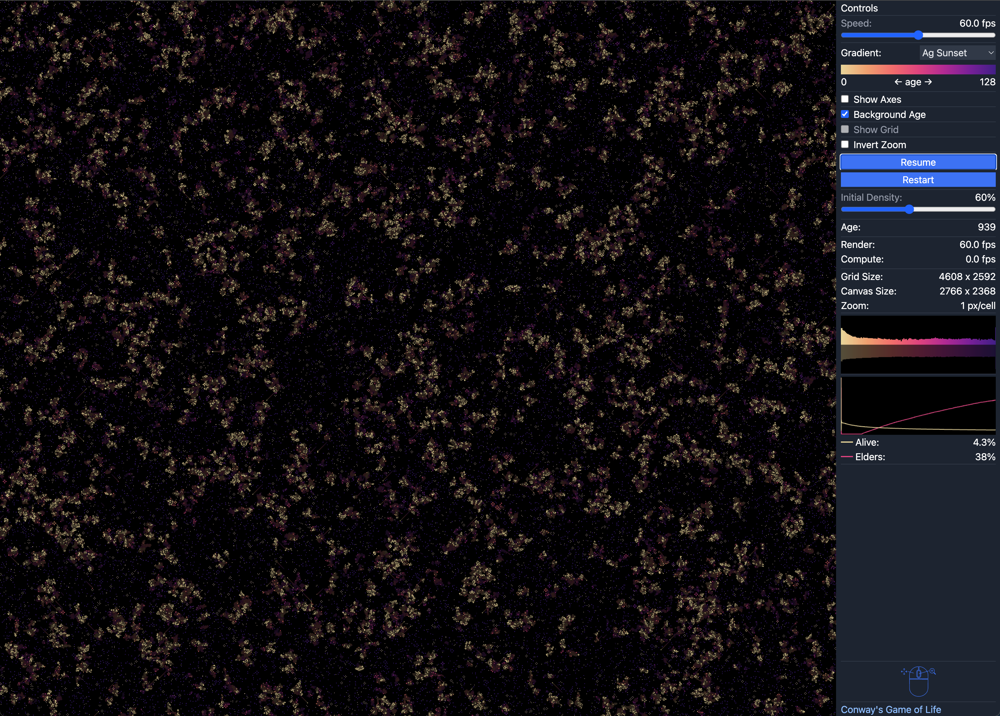

## WebGPU Life

This is an implementation of Conway's Game of Life using WebGPU for massive performance improvements (depending on your GPU).

The implementation uses color to show cell age, shows various metrics in real-time, and allows control of some parameters.

Live demo at https://rulial.life

